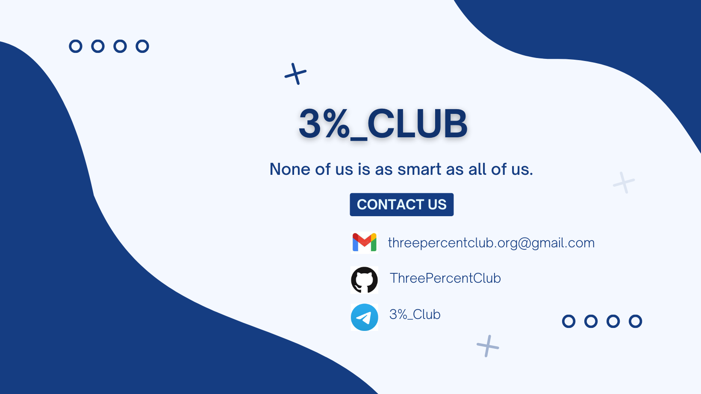

  

<h3 align="center">Technical Guide </h3>

### Official Website-->[Click to View][Link1]
[Link1]:https://threepercentclub.github.io/webpage///

### Connect with me :

&nbsp;&nbsp;

&nbsp;&nbsp;

### Github Stats:
<!--

-->

&nbsp;

